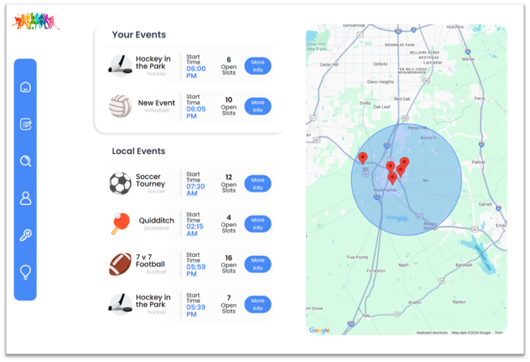

## Quick Match

## Description

Quick Match is a mobile application design to connect enthusiasts with local sports activities, teams, and events. Whether you're a cusual player, a competitive athlete, or somebody trying to stay active, Quick Match makes it easier for a community to discover and engage together in sports. 
We build this application becuase we saw how hard it was to find a community aroung your area that were interested in the same sport.
Quick Match helps out the community by encouraging to be more active as well as being more social.
This application is designed to be intuitive and engaging, making it easy for users of all ages to navigate and find what they need.
Some of the difficulties that we encountered on the way, how to connect the back-end with the front-end. As well as, how can we render the the local events when being deployed.

## Usage

GitHub Repository: https://github.com/JOrullian/group-1-project-2

Deploy: https://quickmatch.onrender.com/

## Credits

Giving thanks to the developers who contributed to the application,
Orullian, Jedediah: https://github.com/JOrullian
Drew Easter: https://github.com/drewheaster
Ray, Jeremiah: https://github.com/jeremydray
Nicholas, Diaz: https://github.com/Gunther0662

## License

This product is distributed under a proprietary license. You can review the full license agreement at the following link: https://mit-license.org/#:~:text=Fork%20this%20project%20to%20create%20your%20own%20MIT%20license%20that

